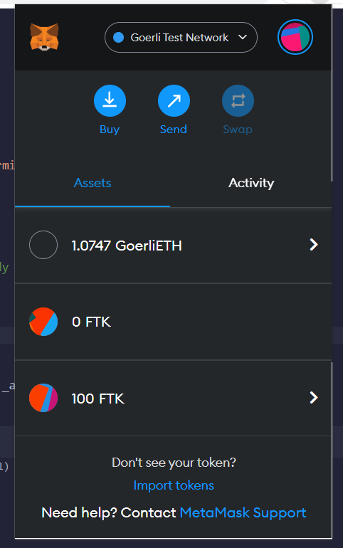

# Fractional-NFT

Deployed in Goerli testnet
FracNFT - https://goerli.etherscan.io/tx/0x1604bea1986dca00494a1c34f76bc9bca347a496307ba5cdf0cdf48627a3619d
FracToken - https://goerli.etherscan.io/tx/0xa2939c3a4db1bf20c12a588c3a5b73415dca4f93a42b6be8f386dcd572a5adee

Minted one new NFT
https://goerli.etherscan.io/tx/0x4b82e4273fb90cac97b0713095a52d328187bccf327ff9ee8aaa65aabda6f4b6
added screenshot

Approve FracToken smart contract to use the NFT by calling setApprovalForAll function
https://goerli.etherscan.io/tx/0x04e277c62fdc63f3c12ea3de91dffe5618bd993581bae2ac6bb07da382166972

Calling initialization function to fractionalize NFT by passing NFT collection address, tokenId and totalSupply
https://goerli.etherscan.io/tx/0x5fb239abe81ce5a73bf789d47d00e79d0970c52e3dafb23f0d97c68b3b59a313

Available NFT transfered to the FracToken smart contract and new fractionalize ERC20 token (I added supply as 100) is minted. 
